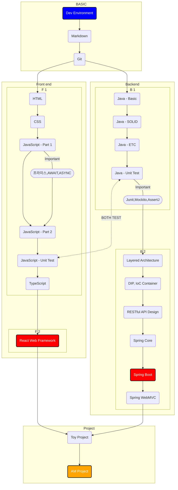
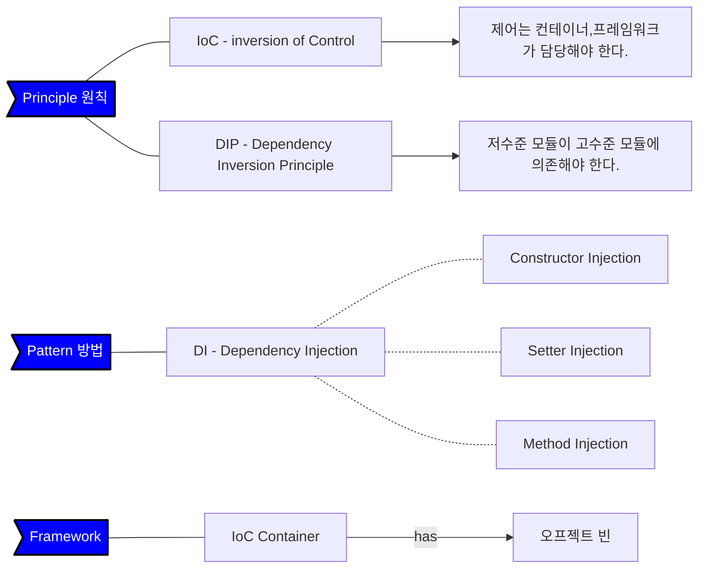

>#### 저는요.
***
| 항목 | 내용 |
| :---: | --- |
| 한글 | ***한규*** |
| 영문 | ***Hank*** |
***

>#### 프로그래밍 경험

> ``console.log("Hello World!");``
> - C#.NET ASP.NET JAVA Android SOAP WCF REST 
> - HTML CSS JAVASCRIPT REACT NEXT.JS NODE.JS PRISMA(ORM)
> - ORACLE MSSQL MYSQL POSTGRESQL  
> - VS CODE, Studio
***
>#### 새로운 경험..

> - Markdown GIT 
> - TYPESCRIPT SPRING BOOT
> - JEST Junit Mockito AssertJ
> - Linux Ubuntu
> - IntelliJ World.  
> - Mermaid
***

>#### 하고 싶은 말

> - 내 주변의 모든 분들이 스승이다.
> - 자신감을 갖자. 
> - 노력하면 언젠간 된다.
> - 아직(?) 젋다.
> - MACBOOK이 없다. 언제 나올라나. 낙오하면 안되는데...

>#### 지금 목표

> - 매일 Github에서 녹색불 붙이기!!!

<wink586@naver.com>
